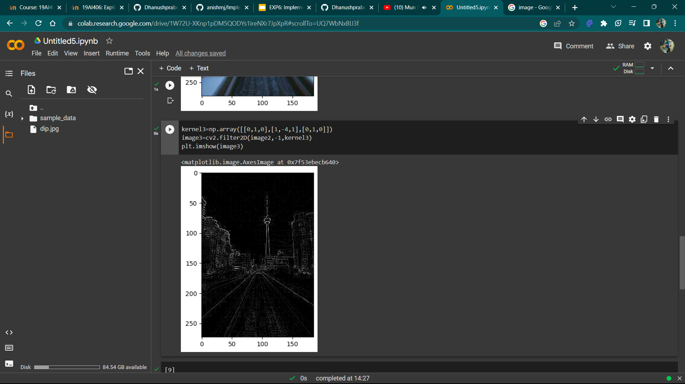

# Implementation-of-Filters
## Aim:
To implement filters for smoothing and sharpening the images in the spatial domain.

## Software Required:
Anaconda - Python 3.7

## Algorithm:
### Step 1:
Import the necessary modules.

### Step 2:
Perform smoothing operation on a image.

Average filter

Weighted average filter

Gaussian Blur

Median filter

### Step 3:
Perform sharpening on a image.

Laplacian Kernel

Laplacian Operator

### Step 4:
Display all the images with their respective filters.

## Program:
### Developed By   :S Dhanush Praboo
### Register Number:212221230019
</br>

### 1. Smoothing Filters

i) Using Averaging Filter
```Python
import cv2
import numpy as np
import matplotlib.pyplot as plt
image1=cv2.imread('dip.jpg')
plt.imshow(image1)
image2=cv2.cvtColor(image1,cv2.COLOR_BGR2RGB)
kernel=np.ones((11,11),np.float32)/121
image3=cv2.filter2D(image2,-1,kernel)
plt.figure(figsize=(9,9))
plt.subplot(1,2,1)
plt.imshow(image2)
plt.title('original')
plt.axis('off')
plt.subplot(1,2,2)
plt.imshow(image1)
plt.imshow(image3)
plt.title('Filtered')
plt.axis('off')


```
ii) Using Weighted Averaging Filter
```Python
kernel2=np.array([[1,2,1],[2,4,2],[1,2,2]])/16
image3=cv2.filter2D(image2,-1,kernel2)
plt.imshow(image3


```
iii) Using Gaussian Filter
```Python
kernel2=np.array([[1,2,1],[2,4,2],[1,2,2]])/16
image3=cv2.filter2D(image2,-1,kernel2)
plt.imshow(image3


```

iv) Using Median Filter
```Python

kernel3=np.array([[0,1,0],[1,-4,1],[0,1,0]])
image3=cv2.filter2D(image2,-1,kernel3)
plt.imshow(image3)


```

### 2. Sharpening Filters
i) Using Laplacian Kernal
```Python
kernel3=np.array([[0,1,0],[1,-4,1],[0,1,0]])
image3=cv2.filter2D(image2,-1,kernel3)
plt.imshow(image3)


```
ii) Using Laplacian Operator
```Python

import cv2
import numpy as np
import matplotlib.pyplot as plt
new_image=cv2.Laplacian(image2,cv2.CV_64F)
plt.imshow(new_image)


```

## OUTPUT:
### 1. Smoothing Filters


i) Using Averaging Filter


ii) Using Weighted Averaging Filter


iii) Using Gaussian Filter


iv) Using Median Filter


### 2. Sharpening Filters
</br>

i) Using Laplacian Kernal


ii) Using Laplacian Operator


## Result:
Thus the filters are designed for smoothing and sharpening the images in the spatial domain.
